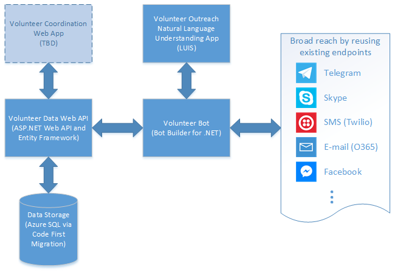

# VolunteerBot

A *bot* (or conversation agent) is a web application designed to connect to users wherever they are already chatting online, from text/sms to email to other popular communication services such as Skype, Slack or Facebook Messenger. 

VolunteerBot is intended to provide a lightweight, automated method for collecting volunteer information and interest for follow up later, taking advantage of the strength of bots to engage potential volunteers on whatever communication services they already use. 

## Architecture

This codebase currently consists of the following components organized into a Visual Studio 2015 solution:

### Volunteer Bot
    An .NET web app built using the [Bot Builder template](http://aka.ms/bf-bc-vstemplate). This contains the actual logic for the bot application itself. 
    
### Volunteer Data Web API
    An [ASP.NET Web API 2](http://www.asp.net/web-api/overview/getting-started-with-aspnet-web-api/tutorial-your-first-web-api) template application that serves as the backend for the Volunteer Bot application to store and retrieve volunteer information. The volunteer data object model is defined using [Entity Framework](https://msdn.microsoft.com/en-us/data/ee712907), and the volunteer database is configured and instantiated using [Code First Migration](https://msdn.microsoft.com/en-us/data/jj591621.aspx).

### Volunteer Outreach Natural Language Understanding App
    A [Language Understanding Intelligent Service (LUIS)](https://www.luis.ai) app with a custom language model to handle conversations for the volunteer management domain. 

### Volunteer Coordination Web App (TBD)
    *Not yet implemented.* A web application with restricted privileges intended for the volunteer coordination staff to review collected volunteer information for further outreach, gauge volunteering interest and other operations over the data collected by the Volunteer Bot. Also potentially the interface for ad hoc outreach via the Volunteer Bot, such as sending out requests to make up for volunteer shortfalls. 
    
More specific information is contained in the README.md for each of the subcomponent folders. 